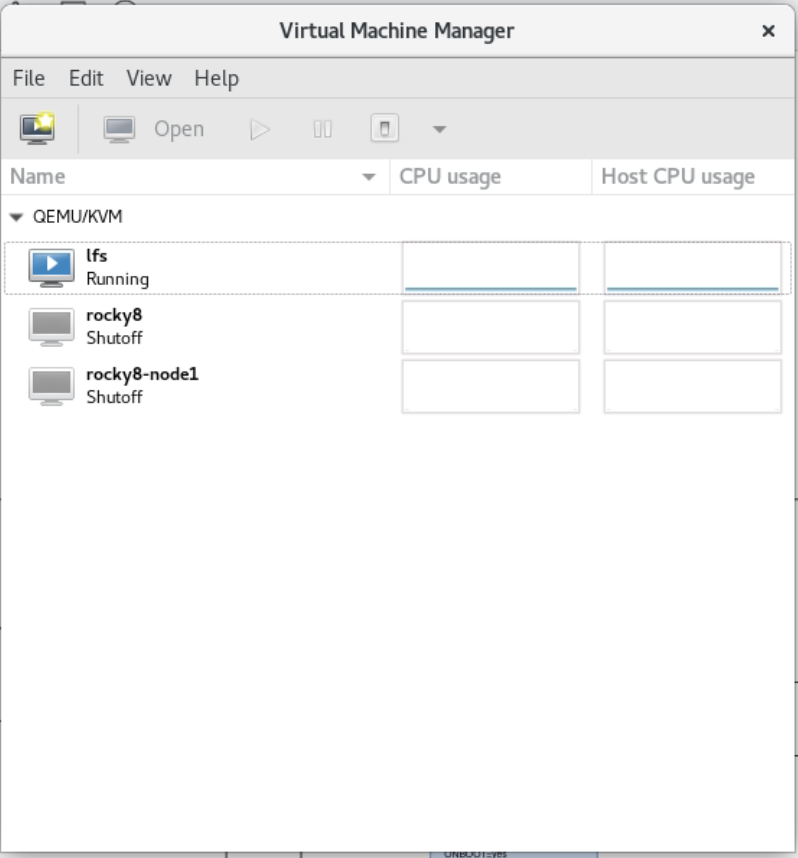
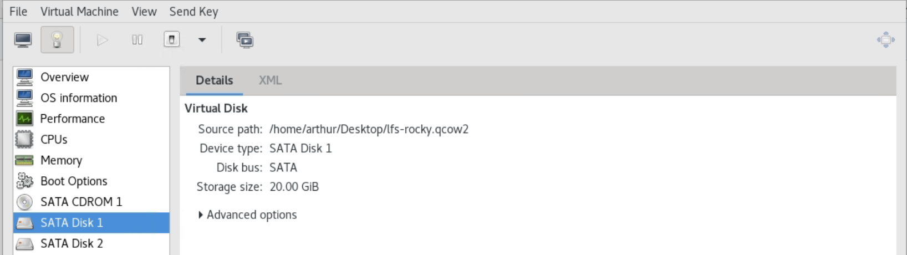
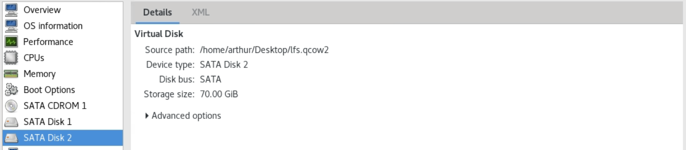
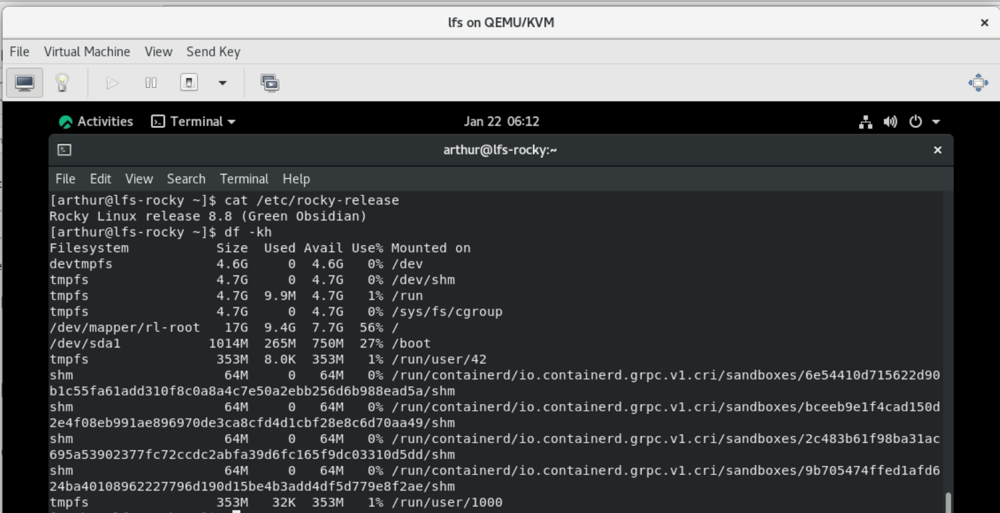
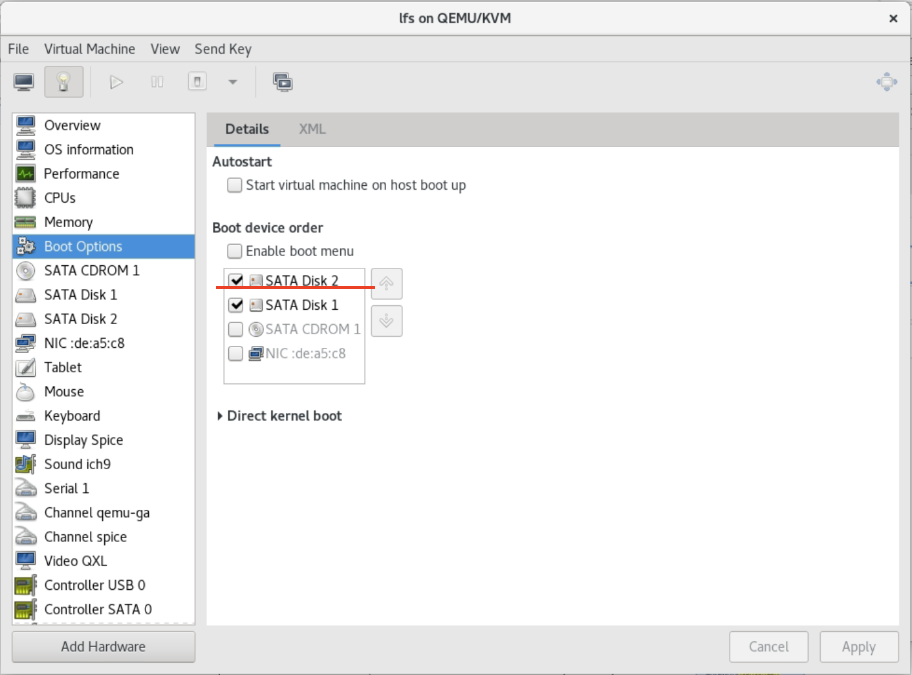
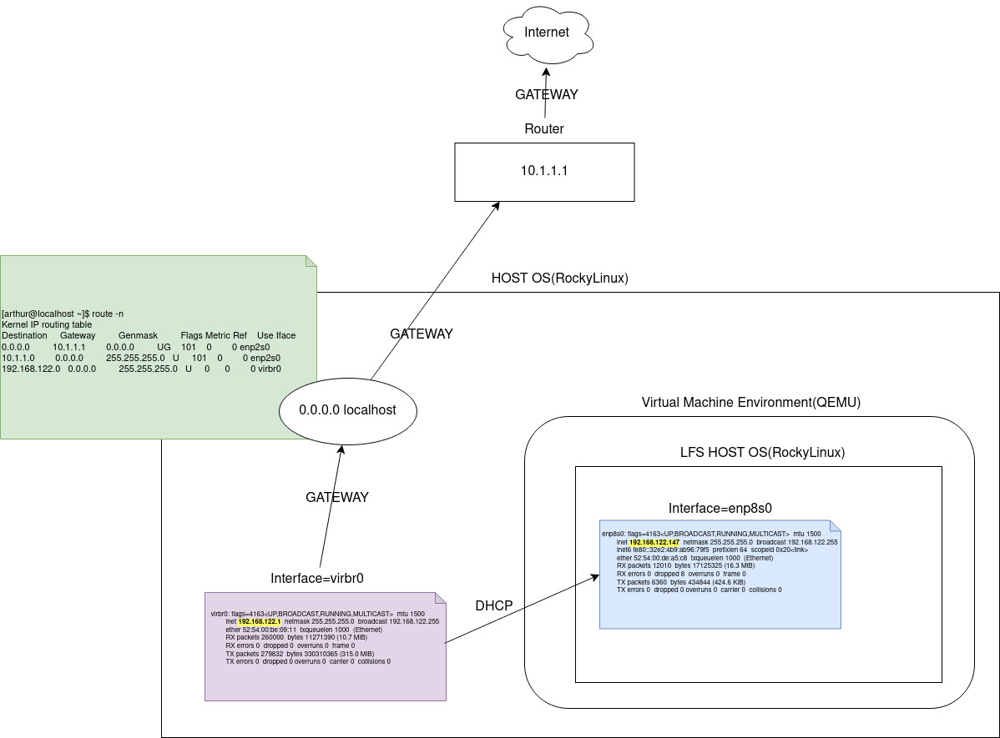
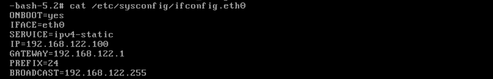
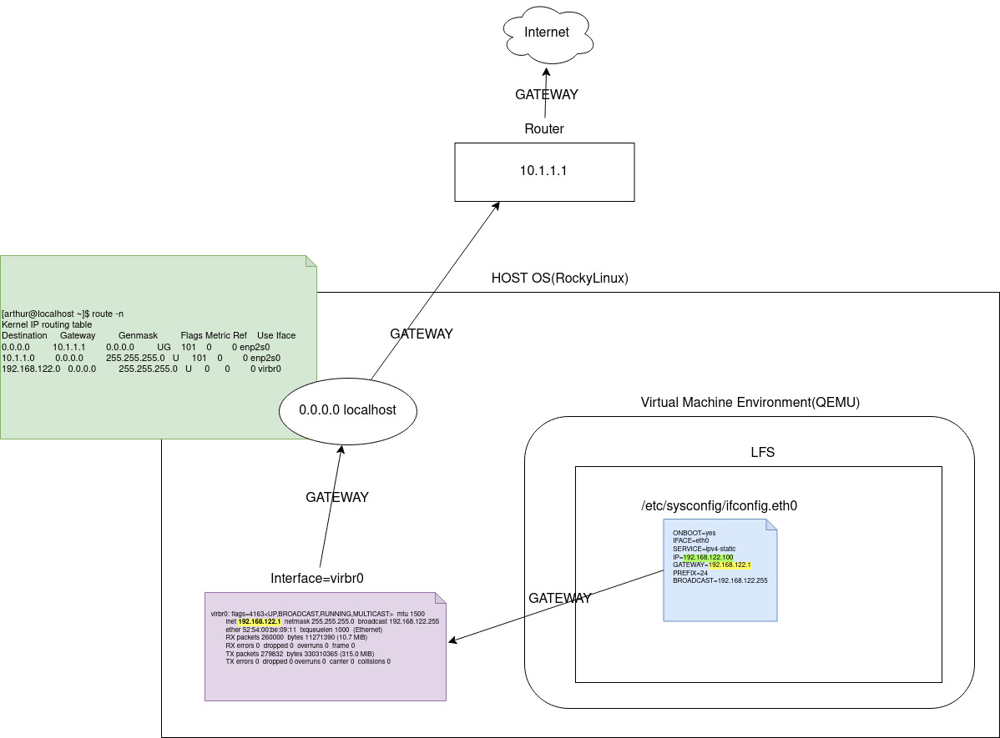

# Linux From Scratch in QEMU
This project provides steps and scripts to build your own linux system in virtual machine envionment. The instruction we follow is Linux From Scratch verion 11.3 (https://www.linuxfromscratch.org/index.html)

## Prerequisites
Host OS: RockyLinux 8 or other Linux distributions<br />
Virtual Machine Environment: QEMU<br />
<br />

## Virtual Machine Setup
* Virtaul Disk 1: Install Virtual Machine Host OS

* Virtual Disk 2: Install Linux From Scratch(LFS)


## Install Virtual Machine Host OS
1. Install OS in Virtual Disk 1(sda) by default Linux partition settings

2. prepare LFS partition
```sh
lsblk
## sdb      8:16    0    70G   0 disk

gdisk /dev/sdb
## create three partitions sdb1(512M), sdb2(1G), sdb3(68.5G) by command (ref: https://linux.die.net/man/8/gdisk). Note that sdb2 needs to change type "Linux swap / Solaris"(hex code=82)
## sdb1: /boot partition
## sdb2: swap
## sdb3: / partition

lsblk
## sdb1      8:16    0    512M    0 part
## sdb2      8:16    0    1G      0 part
## sdb3      8:16    0    68.5G   0 part
```
3. format partitions
```sh
mkfs -v -t ext4 /dev/sdb1
mkfs -v -t ext4 /dev/sdb3
```

## Install Linux From Scratch(LFS)
```sh
./run.sh

cd pkg_compile_cross_toolchain_script && ./install_all.sh

cd pkg_cross_compiling_temporary_tools_script && ./lfs_user_install_all.sh

cd pkg_chroot_tools && cat README ## following README
```

## Setup QEMU Boot Order


## Troubleshooting
### ping google.com hanging
1. Observe infrastructure from QEMU Environment


2. Modify ifconif.eth0


3. Infra after modification
